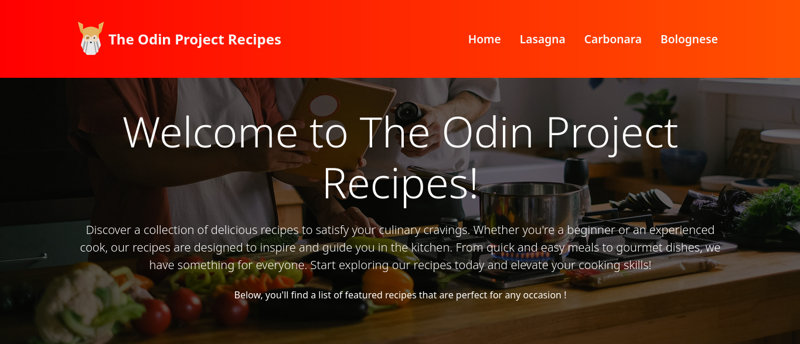
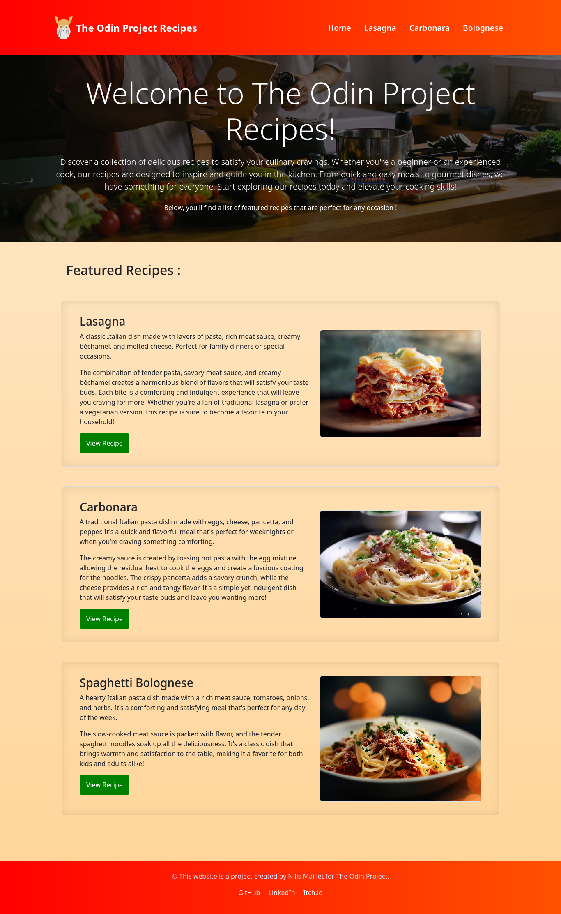
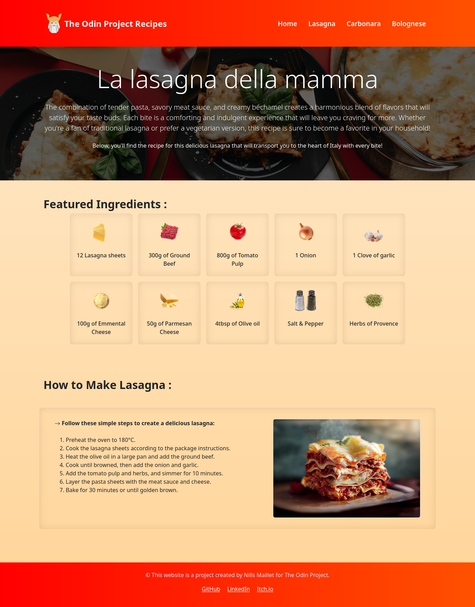

# 🍽️ TheOdinProject — Recipes



A recipe website built as part of [The Odin Project](https://www.theodinproject.com/) curriculum.  
This project focuses on foundational HTML, CSS & JavaScript skills by building a structured, multi-page recipe site with a responsive design.

---

## 🚀 Features

- 🏠 Homepage listing all available recipes
- 📄 Individual recipe pages with ingredients & steps
- 🎨 Responsive layout with Bootstrap & CSS
- ⚡ Dynamic interactions with JavaScript

---

## 🛠️ Built With

[](https://developer.mozilla.org/en-US/docs/Web/HTML)
[](https://developer.mozilla.org/en-US/docs/Web/CSS)
[](https://developer.mozilla.org/en-US/docs/Web/JavaScript)
[](https://getbootstrap.com/)

---

## 📁 Project Structure

```
TheOdinProject-Recipes/
├── index.html
├── css/
├── js/
├── images/
├── includes/
└── pages/
```

---

## 📖 About The Odin Project

This project is part of [The Odin Project](https://www.theodinproject.com/) — a free, open-source curriculum for learning full-stack web development.

---

## 📸 Screenshots

> 

---

> 

---

## 👨‍💻 Author

Maillet Nills  
Computer Science Student – BTS SIO

[](https://maillet-nills.github.io)
[](https://www.linkedin.com/in/nills-maillet-9299a9382/)
[](mailto:mailletnills@gmail.com)
